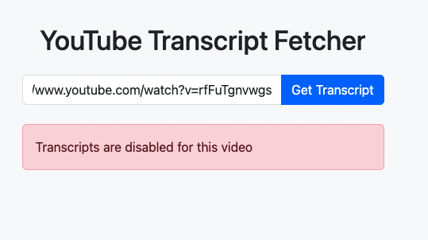

# YouTube Transcript Fetcher

A Flask-based web application that allows users to fetch transcripts from YouTube videos easily. Simply paste a YouTube URL and get the video's transcript in a clean, readable format.



## Features

- Simple and intuitive user interface
- Support for multiple YouTube URL formats
- Real-time transcript fetching
- Copy-to-clipboard functionality
- Error handling for unavailable or disabled transcripts
- Mobile-responsive design

## Technologies Used

- Python 3.11
- Flask
- YouTube Transcript API
- Bootstrap 5
- Font Awesome
- JavaScript

## Getting Started

1. Fork this template to create your own version of the transcript fetcher
2. Click the "Run" button to start the Flask server
3. The application will be available at the provided URL

## Usage

1. Open the application in your web browser
2. Paste a YouTube video URL into the input field
3. Click "Get Transcript" to fetch the transcript
4. Use the "Copy" button to copy the transcript to your clipboard

## API Endpoints

### POST /api/transcript
Fetches the transcript for a given YouTube video

Request body:
```json
{
    "url": "https://www.youtube.com/watch?v=VIDEO_ID"
}
```

Response:
```json
{
    "transcript": [
        {
            "text": "transcript text",
            "start": 0.0,
            "duration": 1.0
        }
        // ...
    ]
}
```

## Error Handling

The application handles various scenarios including:
- Invalid YouTube URLs
- Unavailable videos
- Disabled transcripts
- Missing transcripts
- Network errors

## Limitations

- Only works with public YouTube videos
- Requires English transcripts (will attempt to translate if not available)
- Subject to YouTube's API limitations

## Contributing

Feel free to fork this project and make improvements. Pull requests are welcome!

## License

This project is available under the MIT License.
